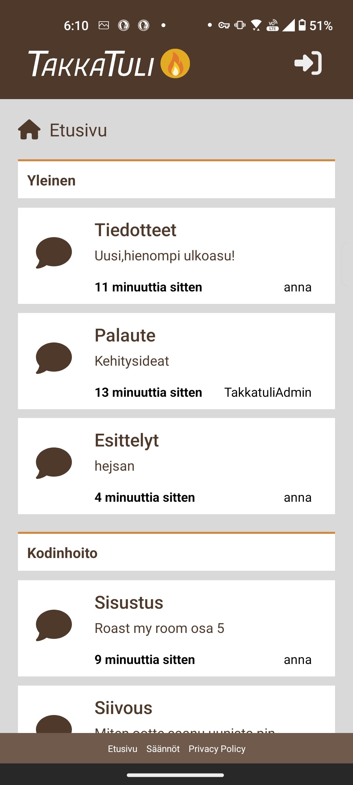
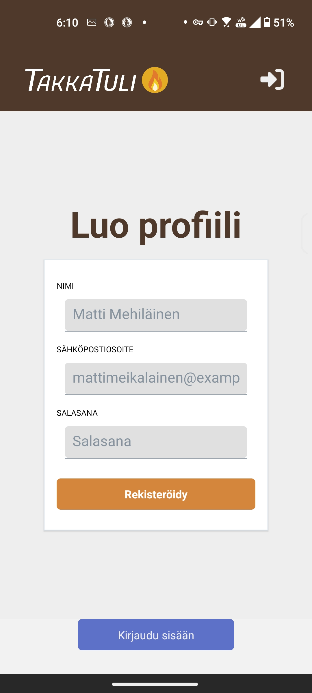
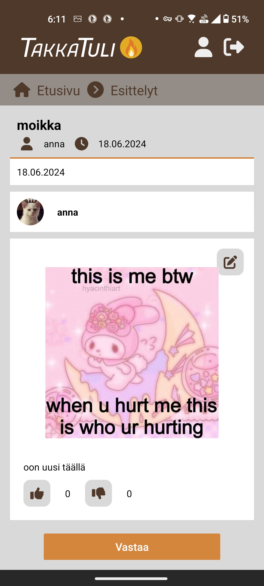
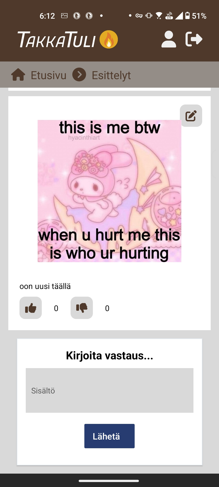
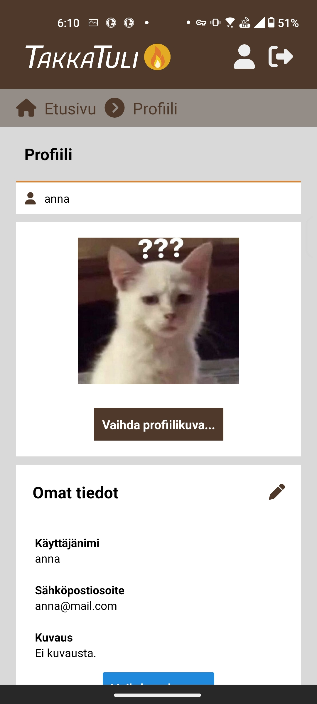
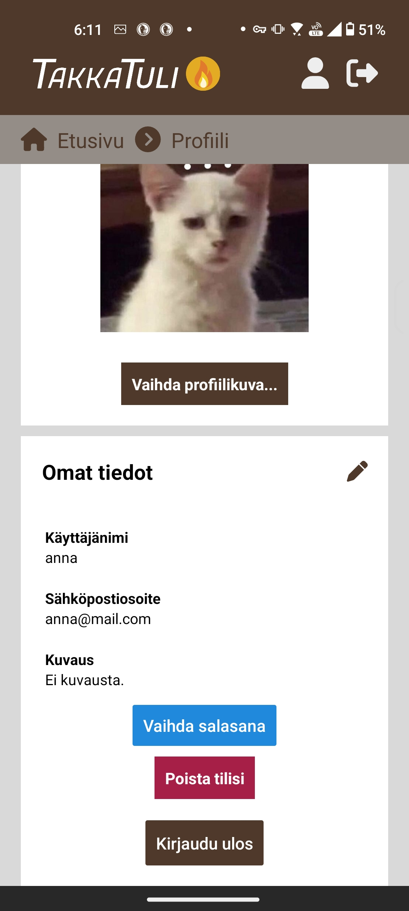

# Takkatuli-foorumi

Takkatuli on kotitalouteen keskittyvä foorumi, jossa voi keskustella vaikkapa remontoinnista, ruuanlaitosta tai puutarhahommista: eri kategorioita sivulta löytyy viisi alakategorioineen.

## Sovelluksen toiminnallisuudet kuvakaappauksineen päivineen

Kun sovelluksen avaa, etusivunäkymä näyttää tältä:

Eri alakategorioita ja postauksia niiden sisällä pystyy selaamaan, vaikka et kirjautuisi sisään. Eri alakategorioiden postauksia voit selailla klikkaamalla niitä:

Foorumille osallistuminen sen sijaan vaatii käyttäjätiliä. Yläpalkin kirjautumisnäppäintä painamalla pääsee kirjautumissivulle:

Sisäänkirjautumissivun alaosassa on näppäin, josta voit siirtyä rekisteröintisivulle, mikäli et ole vielä luonut tiliä.

Kirjautuneena käyttäjänä voit osallistua foorumin keskusteluihin, muokata profiiliasi, tai vaikkapa ylä- tai alapeukuttaa muiden jäsenten postauksia.

Uuden postauksen tekeminen on helppoa: haluamasi alakategorian sivun yläosassa on Uusi lanka -näppäin, jota klikkaamalla pääset postauksen julkaisemiseen.

Postauksella on pakko olla otsikko ja tekstisisältöä, mutta halutessaan siihen voi myös liittää kuvan tai videon.

Julkaistu postaus näyttää tältä:

Julkaistuun postaukseen voit joko vastata painamalla sivun alaosan Vastaa-näppäintä...

...tai lisätä ala- tai yläpeukun ilmaistaksesi mieltäsi. Jos muutat mieltäsi, voit joko poistaa peukkusi painamalla samaa peukkua, jonka olet jo valinnut, tai muuttaa sitä painamalla toista peukkua.

Jos et ole omaan postaukseesi tyytyväinen, pääset muokkaamaan sitä helposti postauksen oikeassa yläkulmassa olevasta muokkausnäppäimestä. Voit muuttaa otsikkoa, tekstisisältöä tai liitettyä tiedostoa.

Tarvittaessa voit myös poistaa oman postauksesi.

Kirjautuneena käyttäjänä voit muokata omaa käyttäjäprofiiliasi klikkaamalla yläpalkkiin ilmestynyttä profiilikuvaketta. Profiilisivullasi pääset lataamaan itsellesi profiilikuvan, kirjoittamaan kuvauksen itsestäsi ja vaihtamaan käyttäjänimesi/sähköpostiosoitteesi tarvittaessa.

Kun vierität sivua vähän alaspäin, löytyy myös näppäimet salasanan vaihtamiselle, tilisi poistamiselle ja uloskirjautumiselle.

Voit myös tutkia muiden käyttäjien profiileja halutessasi. Pääset tarkastelemaan toisen käyttäjän profiilia klikkaamalla hänen nimeään jossain hänen julkaisemassa postauksessa.

## Näin saat sovelluksen toimimaan

1. Pura tämä kansio, ja front endin repositorio (https://github.com/mannals/takkatuli-rn-client) koneellesi.

2. Avaa repositoriot koneellasi, ja muista 'npm install'

3. Luo serverien kansioihin .env-tiedostot .env.samplen mukaisesti. Aseta DB_HOST = localhost ja DB_NAME = ForumApp. UPLOAD_URL on vietävä upload-serverin uploads-kansioon. AUTH_URL, UPLOAD_SERVER ja MEDIA-API ovat linkkejä serverien portteihin.

4. Aja MariaDB:llä tai vastaavalla database-kansiosta löytyvä tietokannan luontiskripti.

5. Käynnistä back-end ja front-end! Back-endissä riittää "npm start" ja front-endissä "npx expo start".

6. Lataa Expo Go kännykkääsi ja skannaa front-endin konsolissa näkyvä QR-koodi.

## Front end

Sovellus on toteutettu React Nativella.

Linkki front-endin repositorioon: 
https://github.com/mannals/takkatuli-rn-client 

## Back end

Sovelluksen back end perustuu kurssilla opetettuun serveriarkkitehtuuriin. Media-API on toteutettu perinteiseen REST API -tapaan.

## Apidoc

Apidoc-sivujen näkymisen kanssa ilmeni ongelmia joita en osannut korjata, mutta jos tämän repositorion purkaa koneelleen ja avaa serverien sisäisistä public-kansioista index.html-tiedoston, näkee niiden API-dokumentaation.

## Tietokanta 

Tietokannan luontiskriptiä pääsee tarkastelemaan tämän repositorion database-kansiosta. Sen pohjana käytin kurssilla annettua esimerkkitietokantaa, ja lähdin miettimään, mitä tarvitsen omaa sovellustani varten.

Olin vähällä tehdä postauksille ja niiden vastauksille eri taulut, mutta päädyin lopulta lisäämään Posts-tauluun reply_to-kentän, jonka voi jättää tyhjäksi, jos julkaisee uuden alkuperäisen postauksen, ja joka vastausten tapauksessa viittaa toisen postauksen post_id-kenttään.

Profiilikuville tein erillisen taulun, joka viittaa käyttäjän user_id-kenttään, jotta Users-taulu ei menisi liian pitkäksi ja käyttäjätietoja voisi hakea ensisijaisesti ilman profiilikuvaa.

Jos mulla olisi ollut enenmmän aikaa, olisin laajentanut tietokantaa lisäämällä sinne taulut Polls, PollOptions ja PollOptionVotes. Näitä polleja olisi voinut myös tehdä ja niihin olisi voinut vastata sovelluksessa.

## Bugit ja ongelmat

Bugeja:

- En saanut apidoc-sivuja aukeamaan serverien porteissa. Sivuille kuitenkin pääsee, jos tämän repositorion purkaa koneelleen ja avaa kunkin serverin public-kansion index.html-tiedoston selaimessa.
- Ylä- tai alapeukkuja annettaessa peukutusten määränumerot näppäinten vieressä päivittyvät vähän viiveellä.
- Tiedoston lataaminen ei aina toimi - yleensä auttaa, jos vain kokeilee uudelleen.
- En saanut tätä millään toteutettua koulun servereillä järkevästi.

Miten jatkaisin sovellustani:

- geneeristen lankaikonien sijaan laittaisin alakategoriasivun postauslaatikoihin thumbnailin mahdollisesta aloituspostaukseen liitetystä kuvasta.
- lisäisin toiminnallisuuden lisätä tiedostoja myös vastauksiin
- mahdollistaisin myös vastauksiin vastaamisen
- lisäisin administraattorinäkymän, jossa voisi mm. poistaa muiden käyttäjien postauksia, tai bannata käyttäjiä. Jossain kohtaa esim. käyttäjäprofiilissa olisi näppäin, josta voisi joko asettaa itsensä suoraan administraattoriksi, tai pyytää admin-oikeuksia.
- tekisin chat-ominaisuuden.

## Referenssit ja käytetyt kirjastot

Referensseinä olen käyttänyt Hybridisovellukset-kurssin materiaaleja, Monialustaprojekti-kurssin ryhmätyöni koodia, Github Copilotia ja eri käyttämieni kirjastojen dokumentaatioita.

### Käyttämäni kirjastot

Back-endin juuri:
- concurrently (servereiden yhtäaikaiseen käynnistämiseen)

Auth-serveri: 
- apidoc
- bcryptjs
- helmet
- jsonwebtoken
- morgan
- mysql2

Media-API:
- apidoc
- bcryptjs
- fetch
- helmet
- jsonwebtoken
- morgan
- multer
- mysql2

Upload-server:
- apidoc
- bcryptjs
- fluent-ffmpeg
- geojson
- helmet
- jsonwebtoken
- morgan
- multer
- sharp

Front end:
- font awesome
- react native elements
- react native async storage
- expo document picker
- expo file system
- moment
- react hook form

