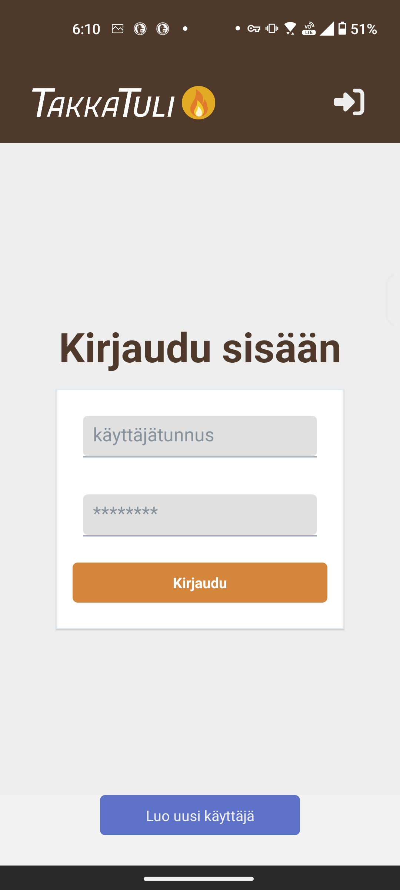

# Takkatuli-foorumi

Takkatuli on kotitalouteen keskittyvä foorumi, jossa voi keskustella vaikkapa remontoinnista, ruuanlaitosta tai puutarhahommista: eri kategorioita sivulta löytyy viisi alakategorioineen.

## Sovelluksen toiminnallisuudet kuvakaappauksineen päivineen

Kun sovelluksen avaa, etusivunäkymä näyttää tältä:

Eri alakategorioita ja postauksia niiden sisällä pystyy selaamaan, vaikka et kirjautuisi sisään. Eri alakategorioiden postauksia voit selailla klikkaamalla niitä:

Foorumille osallistuminen sen sijaan vaatii käyttäjätiliä. Yläpalkin kirjautumisnäppäintä painamalla pääsee kirjautumissivulle:

Sisäänkirjautumissivun alaosassa on näppäin, josta voit siirtyä rekisteröintisivulle, mikäli et ole vielä luonut tiliä.

Kirjautuneena käyttäjänä voit osallistua foorumin keskusteluihin, muokata profiiliasi, tai vaikkapa ylä- tai alapeukuttaa muiden jäsenten postauksia.

Uuden postauksen tekeminen on helppoa: haluamasi alakategorian sivun yläosassa on Uusi lanka -näppäin, jota klikkaamalla pääset postauksen julkaisemiseen.

Postauksella on pakko olla otsikko ja tekstisisältöä, mutta halutessaan siihen voi myös liittää kuvan tai videon.

Julkaistu postaus näyttää tältä:

Julkaistuun postaukseen voit joko vastata painamalla sivun alaosan Vastaa-näppäintä...

...tai lisätä ala- tai yläpeukun ilmaistaksesi mieltäsi. Jos muutat mieltäsi, voit joko poistaa peukkusi painamalla samaa peukkua, jonka olet jo valinnut, tai muuttaa sitä painamalla toista peukkua.

Jos et ole omaan postaukseesi tyytyväinen, pääset muokkaamaan sitä helposti postauksen oikeassa yläkulmassa olevasta muokkausnäppäimestä. Voit muuttaa otsikkoa, tekstisisältöä tai liitettyä tiedostoa.

Tarvittaessa voit myös poistaa oman postauksesi.

Kirjautuneena käyttäjänä voit muokata omaa käyttäjäprofiiliasi klikkaamalla yläpalkkiin ilmestynyttä profiilikuvaketta. Profiilisivullasi pääset lataamaan itsellesi profiilikuvan, kirjoittamaan kuvauksen itsestäsi ja vaihtamaan käyttäjänimesi/sähköpostiosoitteesi tarvittaessa.

Kun vierität sivua vähän alaspäin, löytyy myös näppäimet salasanan vaihtamiselle, tilisi poistamiselle ja uloskirjautumiselle.

Voit myös tutkia muiden käyttäjien profiileja halutessasi. Pääset tarkastelemaan toisen käyttäjän profiilia klikkaamalla hänen nimeään jossain hänen julkaisemassa postauksessa.

## Front end

Sovellus on toteutettu React Nativella.

1. Pura front endin repositorio koneellesi: https://github.com/mannals/takkatuli-rn-client

2. Avaa repositoriot koneellasi, ja muista 'npm install'

3. Lataa kännykällesi Expo Go -sovellus.

4. Avaa front endin kansio IDE:ssäsi, ja suorita terminaalissa komento "npx expo start". Terminaaliin ilmestyy QR-koodi, jonka voit skannata joko Expo Golla jos olet Android-käyttäjä, tai kännykkäsi kameralla jos olet iPhone-käyttäjä.

5. profit

## Back end

On tämä repositorio.

## Apidoc

## Tietokanta 

## Bugit ja ongelmat

Bugeja:

- En saanut apidoc-sivua aukeamaan media-apissa tai upload-serverissä. Sivuille kuitenkin pääsee, jos tämän repositorion purkaa koneelleen ja avaa kunkin serverin public-kansion index.html-tiedoston selaimessa.

Miten jatkaisin sovellustani:

- geneeristen lankaikonien sijaan laittaisin alakategoriasivun postauslaatikoihin thumbnailin mahdollisesta aloituspostaukseen liitetystä kuvasta.
- lisäisin toiminnallisuuden lisätä tiedostoja myös vastauksiin
- mahdollistaisin myös vastauksiin vastaamisen
- lisäisin administraattorinäkymän, jossa voisi mm. poistaa muiden käyttäjien postauksia, tai bannata käyttäjiä. Jossain kohtaa esim. käyttäjäprofiilissa olisi näppäin, josta voisi joko asettaa itsensä suoraan administraattoriksi, tai pyytää admin-oikeuksia.
- tekisin chat-ominaisuuden.

## Referenssit ja käytetyt kirjastot

Referensseinä olen käyttänyt Hybridisovellukset-kurssin materiaaleja, Monialustaprojekti-kurssin ryhmätyöni koodia, Github Copilotia ja eri käyttämieni kirjastojen dokumentaatioita.

